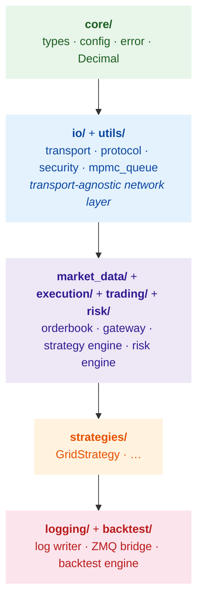

<div align="center">

# ⚡ libchronos

**Ultra-low latency C++20 HFT library — the engine behind Chronos**

<span style="font-size:1.1em;color:#8b949e">38 headers · 55K LoC · 256 tests · 5 benchmarks · 6 design patterns</span>

<br>

[](LICENSE)
[](https://en.cppreference.com/w/cpp/20)
[]()
[]()
[](https://github.com/leafxuzm/libchronos/actions)

</div>

---

<table align="center"><tr>
<td align="center"><b>13.8μs</b><br><sub>E2E latency<br>tick→decision</sub></td>
<td align="center"><b>2.6M/s</b><br><sub>System<br>throughput</sub></td>
<td align="center"><b>6</b><br><sub>Design<br>patterns</sub></td>
<td align="center"><b>256</b><br><sub>Tests<br>29 suites</sub></td>
<td align="center"><b>3</b><br><sub>Sanitizer<br>configs</sub></td>
</tr></table>

---

## Module Layering



<div class="callout" style="background:#0d3323;border-left:4px solid #3fb950;padding:0.8rem 1rem;border-radius:0 6px 6px 0;margin:1rem 0;">

**Lower layers never depend on upper layers.** `io/` is transport-agnostic — WebSocket (Binance/OKX), TCP (SSE STEP), and UDP multicast (SZSE MDDP) all implement the same `Transport`/`Protocol` interfaces. `core/` has zero internal dependencies.

</div>

### Module Map

| Layer | Module | Headers | Responsibility |
|:------|:-------|:--------|:---------------|
| **L0** | `core/` | `types.hpp` `config.hpp` `error.hpp` | `Decimal` fixed-point, `Tick` (64B), `OrderRequest` (128B), `Fill` (128B), all enums |
| **L1** | `io/` | `transport.hpp` `protocol.hpp` `security.hpp` | Abstract transport/protocol interfaces; TLS WebSocket, Binance/OKX JSON, HMAC-SHA256 |
| **L1** | `utils/` | `mpmc_queue.hpp` `cpu_affinity.hpp` | Lock-free MPMC queue (Vyukov), CPU pinning |
| **L2** | `market_data/` | `orderbook_v2.hpp` `any_gateway.hpp` `adapter_concept.hpp` | Hot/cold OrderBook, type-erased gateway, exchange adapters |
| **L2** | `execution/` | `order_gateway.hpp` `binance_http_client.hpp` | Order lifecycle, REST client, user-data stream |
| **L2** | `trading/` | `strategy_engine.hpp` `position_manager.hpp` `order_id_generator.hpp` | Strategy dispatch, position tracking, ID generation |
| **L2** | `risk/` | `risk_engine.hpp` | 5-check pre-trade risk <1μs |
| **L3** | `strategies/` | `grid_strategy.hpp` | Strategy implementations (base class in `trading/`) |
| **L4** | `logging/` | `log_writer.hpp` `log_reader.hpp` `zmq_bridge.hpp` | Binary logging, mmap reader, ZMQ PUB-SUB bridge |
| **L4** | `backtest/` | `backtest_engine.hpp` `time_replayer.hpp` `metrics.hpp` | Historical replay, multi-stream merge, Sharpe/Sortino/Calmar |

---

## Performance

<p align="center"><i>Apple M1 Max, -O3 -march=native -mtune=native, Clang 17</i></p>

| Component | Operation | Measured | vs Target |
|:----------|:----------|:--------:|:---------:|
| MPMC Queue | push / pop | <50ns | |
| OrderBook V2 | best bid/ask (hot) | <10ns | |
| OrderBook V2 | top 5 levels (hot) | <10ns | |
| OrderBook V2 | full 20 levels (cold) | <50ns | |
| OrderBook V2 | update | <100ns | |
| OrderIDGenerator | `nextID()` | <10ns | |
| RiskEngine | `checkOrder()` | <1μs | |
| StrategyEngine | `onTick()` dispatch | ~3μs | |
| **End-to-end** | **tick → strategy decision** | **13.8μs** | 3.6× below budget |
| **System throughput** | **tick processing** | **>2.6M/s** | 2.6× above target |

<br>

<table>
<tr>
<th>E2E Optimization</th><th>P50 Latency</th><th>Improvement</th>
</tr>
<tr>
<td>Baseline <code>std::this_thread::yield()</code></td>
<td align="center">90–207μs</td><td align="center">—</td>
</tr>
<tr>
<td bgcolor="#0d3323"><b>Busy-spin</b> <code>cpuRelax()</code></td>
<td align="center" bgcolor="#0d3323"><b>13.8μs</b></td>
<td align="center" bgcolor="#0d3323"><b>7.4× faster</b></td>
</tr>
<tr>
<td>Busy-spin + CPU affinity</td>
<td align="center">13.2μs</td>
<td align="center">marginal gain*</td>
</tr>
</table>

<sub>*CPU affinity prevents residual jitter (tail latency). The dominant factor is avoiding OS scheduler invocations.</sub>

---

## Design Patterns

<table>
<tr>
<th width="30%">Pattern</th><th>Description</th>
</tr>
<tr>
<td bgcolor="#0c2d48"><b>Hot/Cold Data Separation</b></td>
<td bgcolor="#0c2d48">Frequently accessed fields (top 5 price levels) in compact cache-aligned structs; cold data in separate storage. <code>OrderBookV2</code> hot path reads from L1 cache only.</td>
</tr>
<tr>
<td bgcolor="#1c2128"><b>Optimistic Locking</b> <sub>(Seqlock)</sub></td>
<td bgcolor="#1c2128">Atomic 64-bit version counter. Reader retries if version changed during read. Zero writer-blocking.</td>
</tr>
<tr>
<td bgcolor="#0c2d48"><b>Double Buffering</b> <sub>(RCU-style)</sub></td>
<td bgcolor="#0c2d48">Two data copies; writer updates the dark buffer, then atomic pointer swap makes it visible. No reader locks.</td>
</tr>
<tr>
<td bgcolor="#1c2128"><b>Busy-Spin + CPU Affinity</b></td>
<td bgcolor="#1c2128">Engine and Gateway threads replace <code>yield()</code> with <code>cpuRelax()</code> (inline <code>PAUSE</code>/<code>YIELD</code> instruction). Pinned to dedicated cores via <code>pthread_setaffinity_np</code> / Mach thread affinity to prevent cache migration.</td>
</tr>
<tr>
<td bgcolor="#0c2d48"><b>Fixed-Point Arithmetic</b></td>
<td bgcolor="#0c2d48">All financial values use <code>Decimal</code> = <code>fpm::fixed&lt;int64_t, __int128, 32&gt;</code> (64-bit, 32 fractional bits). No floating-point rounding errors.</td>
</tr>
<tr>
<td bgcolor="#1c2128"><b>Process Isolation via ZMQ</b></td>
<td bgcolor="#1c2128">Latency-critical core in one process; I/O-heavy logging/backtest in separate processes connected by ZMQ PUB-SUB.</td>
</tr>
</table>

---

## Quick Start

### Prerequisites

| OS | Command |
|:---|:--------|
| **macOS** | `brew install cmake boost openssl zeromq pkg-config` |
| **Ubuntu** | `sudo apt install cmake build-essential libboost-dev libssl-dev libzmq3-dev pkg-config` |

### Build

```bash
git clone https://github.com/leafxuzm/libchronos-deps.git
git clone https://github.com/leafxuzm/libchronos.git
cd libchronos
mkdir build && cd build
cmake .. -DCMAKE_BUILD_TYPE=Release
make -j$(nproc 2>/dev/null || sysctl -n hw.logicalcpu)
```

<div class="callout" style="background:#0d3323;border-left:4px solid #3fb950;padding:0.8rem 1rem;border-radius:0 6px 6px 0;margin:1rem 0;">

Third-party dependencies (fpm, spdlog, yaml-cpp, gflags, nlohmann_json, simdjson, libzmq, Boost, OpenSSL) are fetched automatically via `FetchContent` from the sibling `libchronos-deps` repository.

</div>

### Build Options

| Option | Default | Purpose |
|--------|---------|---------|
| `CMAKE_BUILD_TYPE` | — | `Debug`, `Release`, `RelWithDebInfo` |
| `BUILD_TESTS` | `ON` | Unit/integration test suite |
| `BUILD_BENCHMARKS` | `ON` | Performance microbenchmarks |
| `CHRONOS_ENABLE_ASAN` | `OFF` | AddressSanitizer |
| `CHRONOS_ENABLE_TSAN` | `OFF` | ThreadSanitizer |
| `CHRONOS_ENABLE_UBSAN` | `OFF` | UndefinedBehaviorSanitizer |

### Run Tests

```bash
# All tests
ctest --output-on-failure

# Single test suite
./tests/unit/unit_tests --gtest_filter=OrderBookV2Test.*

# Benchmarks
./benchmark/chronos_benchmarks --benchmark_min_time=0.1
```

### Consume as a Dependency

```cmake
# In your project's CMakeLists.txt or FindChronos.cmake
add_library(chronos STATIC IMPORTED)
set_target_properties(chronos PROPERTIES
    IMPORTED_LOCATION /path/to/libchronos.a
    INTERFACE_INCLUDE_DIRECTORIES /path/to/libchronos/include
    INTERFACE_COMPILE_DEFINITIONS CHRONOS_HAS_LIVE_MODE
)
target_link_libraries(chronos INTERFACE chronos_deps)
target_link_libraries(your_app PRIVATE chronos)
```

Pre-built `libchronos.a` binaries are available on [GitHub Releases](https://github.com/leafxuzm/libchronos/releases) for macOS (arm64 / x86_64) and Linux (x86_64).

---

## Testing & Quality

| Dimension | Coverage |
|:----------|:---------|
| **Unit tests** | 256 tests across 29 suites |
| **Property-based tests** | 23 PBT properties (RapidCheck) |
| **Sanitizers** | ASan, TSan, UBSan in CI |
| **Platforms** | macOS arm64/x86_64, Ubuntu x86_64 |
| **Build types** | Debug, Release, RelWithDebInfo |
| **Integration tests** | 9 trading pipeline integration tests |
| **Connectivity tests** | Binance + OKX testnet live tests |

---

## Project Family

<p align="center">

| Repository | Visibility | Purpose |
|:-----------|:----------:|:--------|
| [libchronos-deps](https://github.com/leafxuzm/libchronos-deps) | Public | Third-party dependency aggregation (FetchContent) |
| [**libchronos**](https://github.com/leafxuzm/libchronos) | Public | **Core library (libchronos.a) — all algorithm implementations** |
| [trading_engine](https://github.com/leafxuzm/trading_engine) | Public | Application demo — pipeline orchestration |

</p>

---

## Design Philosophy

<div class="callout" style="background:#1c2128;border-left:4px solid #d2991d;padding:1rem 1.2rem;border-radius:0 8px 8px 0;margin:1rem 0;">

<p style="font-size:1.05em;margin:0 0 0.8rem 0;"><b>"懂C++ ≠ 懂延迟"</b></p>
<p style="margin:0;color:#8b949e;">Understanding C++ is necessary but not sufficient for low-latency programming. Latency comes from understanding the hardware: cache hierarchy, store buffers, branch predictors, and memory ordering. A technically correct C++ program can still destroy cache locality, trigger false sharing, or stall on unnecessary barriers.</p>

</div>

| # | Principle |
|:-:|:----------|
| 1 | **Measure, don't assume.** Every component has a latency budget and a benchmark. |
| 2 | **Cold data must not pollute hot cache lines.** `alignas(64)` on all shared-memory data structures. |
| 3 | **Lock-free where it matters.** CAS loops over mutexes when contention is low; MPMC queue decouples producer-consumer. |
| 4 | **No allocation on the hot path.** Pre-allocated object pools, fixed-size arrays, no `std::vector` in tick processing. |
| 5 | **Explicit memory ordering.** Every `std::atomic` has an explicit `std::memory_order` — no implicit sequential consistency. |
| 6 | **Never enter the kernel on the hot path.** Busy-spin with `cpuRelax()` — `std::this_thread::yield()` costs 10–100μs in scheduler overhead. |

<br>

<div align="center">

---

<p style="color:#8b949e;font-size:0.85em;">
  libchronos · MIT License · <a href="https://github.com/leafxuzm/libchronos">GitHub</a>
</p>

</div>
